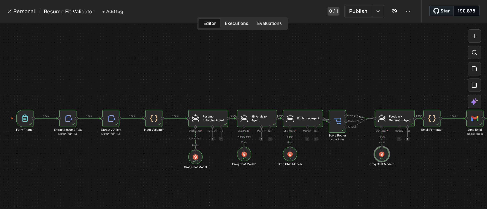
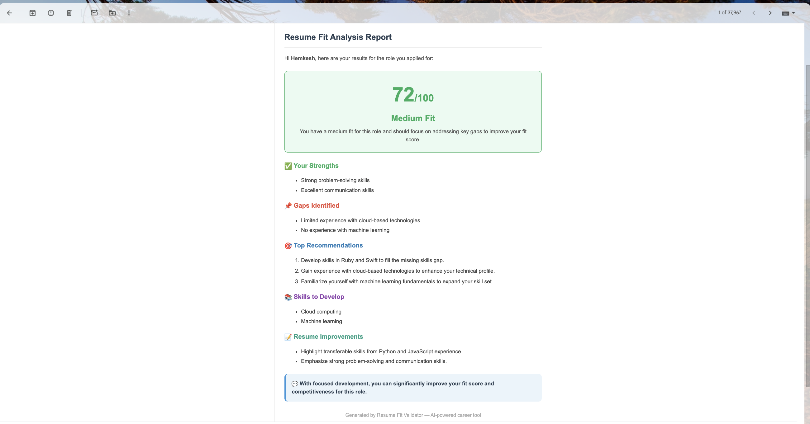
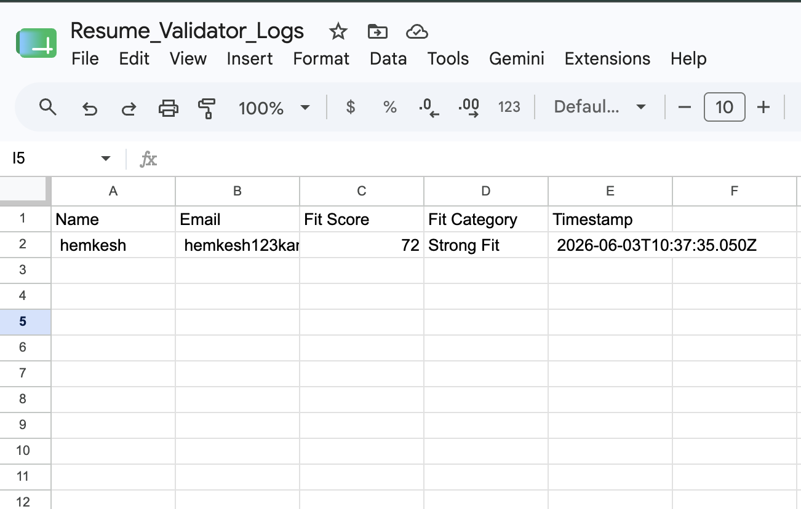

# Resume Fit Validator — Agentic Workflow (n8n)

## Problem Statement

**User:** Job seekers and placement students applying for roles

**Pain Point:** Candidates spend hours tailoring resumes without knowing how well they actually match a job description. There's no instant, structured way to get a fit score, identify gaps, and get actionable feedback before applying.

**What this workflow does:** A candidate uploads their resume and a job description via a form. Four AI agents analyze the documents, score the fit, and deliver a detailed feedback report to their email — automatically.

**Output:** A structured HTML email report with a fit score (0–100), strengths, gaps, skill recommendations, and tailored improvement advice.

---

## Workflow Architecture



### Flow Summary

```
Form Submission (Resume + JD upload)
        ↓
Extract text from Resume PDF
        ↓
Extract text from JD PDF
        ↓
Input Validator (checks files are readable)
        ↓
Resume Extractor Agent → structured JSON
        ↓
JD Analyzer Agent → structured JSON
        ↓
Fit Scorer Agent → score + strengths + gaps
        ↓
Score Router → Strong Fit / Medium Fit / Weak Fit
        ↓
Feedback Generator Agent → tailored recommendations
        ↓
Email Formatter → styled HTML report
        ↓
Send Email to candidate + Log to Google Sheet
```

---

## Nodes Breakdown (12 nodes)

| # | Node | Type | Purpose |
|---|---|---|---|
| 1 | Form Trigger | Trigger | Collects Name, Email, Resume file, JD file |
| 2 | Extract Resume Text | Extract From File | Parses resume PDF to plain text |
| 3 | Extract JD Text | Extract From File | Parses JD PDF to plain text |
| 4 | Input Validator | Code | Validates extracted text is non-empty and usable |
| 5 | Resume Extractor Agent | AI Agent | Extracts skills, experience, education into JSON |
| 6 | JD Analyzer Agent | AI Agent | Extracts required skills, experience, responsibilities |
| 7 | Fit Scorer Agent | AI Agent | Compares both JSONs, outputs score + gaps + strengths |
| 8 | Score Router | Switch | Routes by score: ≥70 Strong / 40–69 Medium / <40 Weak |
| 9 | Feedback Generator Agent | AI Agent | Generates tailored recommendations by fit category |
| 10 | Email Formatter | Code | Builds styled HTML email from all agent outputs |
| 11 | Send Email | Gmail | Sends report to candidate |
| 12 | Log to Google Sheet | Google Sheets | Records session: name, email, score, category, timestamp |

---

## AI vs Deterministic Steps

### AI is used for (reasoning-heavy tasks):
- **Resume Extractor Agent** — understands resume structure, extracts relevant fields regardless of format
- **JD Analyzer Agent** — identifies required vs preferred skills, understands job context
- **Fit Scorer Agent** — compares two structured JSONs, reasons about fit quality, scores objectively
- **Feedback Generator Agent** — generates category-specific, actionable advice in natural language

### Deterministic logic handles (rule-based tasks):
- **Input Validator** — checks file content length, catches empty or unreadable uploads
- **Score Router** — threshold-based routing: score ≥ 70 → Strong, ≥ 40 → Medium, else Weak
- **Email Formatter** — maps score to color coding, builds HTML structure from data
- **Google Sheets logging** — structured record keeping, no reasoning needed

---

## Agentic Practices Demonstrated

| Practice | Where Used |
|---|---|
| **Role definition** | Each of 4 agents has one clearly defined job (extractor, analyzer, scorer, advisor) |
| **Structured outputs** | Every agent returns strict JSON schema — no free-form text |
| **Tool use** | Gmail (email delivery), Google Sheets (logging), n8n Form (input collection) |
| **Branching / routing** | Score Router sends different fit categories down different paths |
| **Deterministic checks** | Input validation before any AI runs; score thresholds for routing |
| **Fallback handling** | Input Validator throws a clear error if files can't be read, stopping pipeline early |

---

## Tech Stack

| Component | Tool |
|---|---|
| Workflow orchestration | n8n Cloud (free trial) |
| AI model | Groq — `llama-3.3-70b-versatile` (free tier) |
| File parsing | n8n Extract From File node (PDF) |
| Email delivery | Gmail via OAuth2 |
| Session logging | Google Sheets via OAuth2 |
| Form interface | n8n built-in Form Trigger |

---

## Sample Input / Output

### Input
- **Resume:** Software engineering resume (6 months of experience, Python, React, SQL)
- **Job Description:** Backend Engineer Intern role 

### Output Email


**Score:** 72/100 — Medium Fit

**Strengths identified:**
- Strong Problem Solving Skills
- Excellent communication skills

**Gaps identified:**
- Limited experience with cloud-based technologies
- No experience with machine learning

**Top Recommendations:**
1. Develop skills in Ruby and Swift to fill the missing skills gap.
2. Gain experience with cloud-based technologies to enhance your technical profile.
3. Familiarize yourself with machine learning fundamentals to expand your skill set.

---

## Google Sheet Log



---

## Limitations & Future Improvements

- **File type dependency** — only works with text-based PDFs; scanned image PDFs cannot be parsed
- **Single-pass evaluation** — no iterative refinement of the fit score
- **No human-in-the-loop** — feedback goes directly to candidate; a recruiter review step could be added
- **English only** — agents work best with English language resumes and JDs
- **Future:** Add a cover letter generator node that uses the fit analysis to auto-draft a tailored cover letter
- **Future:** Multi-round feedback where candidate can refine resume and re-score

---

## How to Run

1. Import `workflow.json` into n8n
2. Set up credentials: Groq API, Gmail OAuth2, Google Sheets OAuth2
3. Update the Google Sheet ID in the Log node
4. Activate the workflow
5. Open the Form URL and submit a resume + JD

---

## Files in This Repo

| File | Description |
|---|---|
| `README.md` | This file — full project documentation |
| `workflow.json` | Exportable n8n workflow — import directly into n8n |
| `screenshots/` | Workflow canvas, form UI, sample output, sheet log |
| `sample/` | Sample resume and JD PDFs used for demo |
